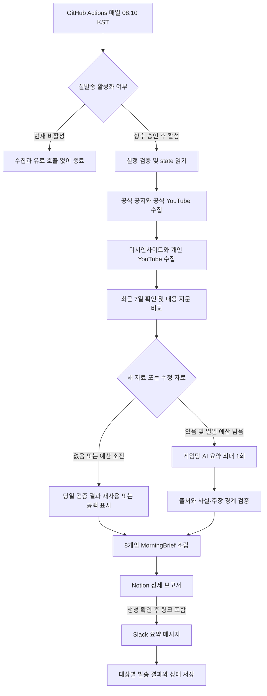
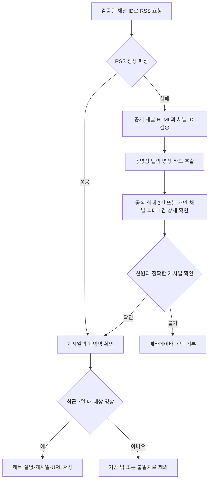
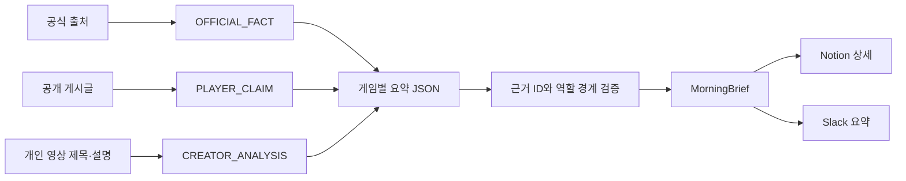
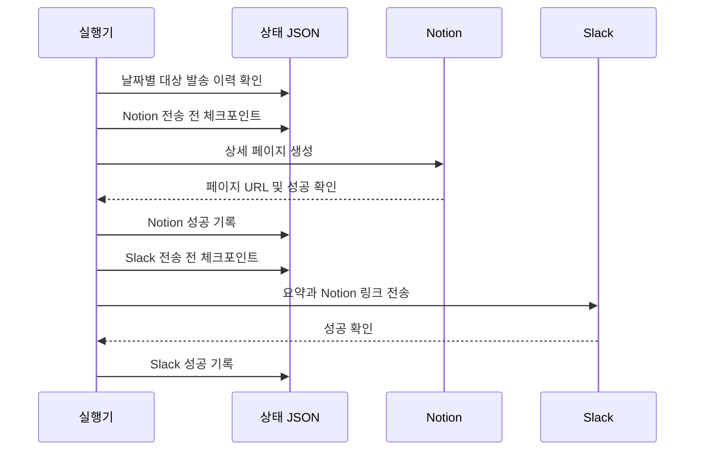

# 🎮 GAME PM Morning Brief — 기술서

> 기준일: 2026-09-04 · 기본 실행 방식: `compact-v1` · 플랫폼 실발송 전 단계
>
> 이 문서는 현재 코드와 설정, 기록된 진단 결과를 설명한다. 설계 목표를 운영 완료로 표현하지 않는다. Mermaid 도식은 GitHub의 이 Markdown 문서에서 확인할 수 있다.

## 1. 한눈에 보는 프로젝트

8개 게임의 공식 소식과 공개 이용자 반응을 수집하고, 근거가 연결된 한국어 보고서를 만들어 Slack에는 요약, Notion에는 상세 내용을 전달하는 프로젝트다. PC 대신 GitHub Actions에서 실행하도록 구성했다.

현재는 **수집·요약·검증·보고서 포맷·전송 코드가 구현되어 있고, 실제 Slack/Notion 연결과 통합 발송 검증이 남아 있는 상태**다. `live_delivery_enabled=false`이므로 예약 실행은 수집과 유료 호출 전에 종료한다.

| 구분 | 현재 상태 | 의미 |
|---|---|---|
| 공식 공지 어댑터 | 8게임 구현, 접근 품질은 게임별 상이 | 구현됐다는 사실과 매일 본문을 읽을 수 있다는 사실은 다름 |
| 공개 반응 | 8게임 디시인사이드 + 개인 YouTube 12채널 구성 | 표본 조사이며 전체 여론 분석이 아님 |
| YouTube 보완 | 로컬 검증 완료 | 최신 목록 형식 지원, GitHub에서 수정 후 수집은 아직 재검증 전 |
| AI 요약 | 게임별 통합 요약·검증·일일 호출 제한 구현 | 이번 작업에서는 유료 호출하지 않음 |
| Slack·Notion | 포맷과 전송 어댑터 구현 | 실제 계정 권한·수신 결과는 별도 확인 필요 |
| 예약 실행 | 매일 08:10 KST 설정 | 실행 요청 시각이며 보고서 도착 시각을 보장하지 않음 |
| 상태 저장 | `state` 브랜치 JSON 경로 구현 | 발송 체크포인트를 포함한 실제 통합 복구 검증 필요 |
| Game Radar | 보류·비활성화 | 외부 게임 자동 추가는 현재 동작하지 않음 |

### 보고서 고정 순서

| 그룹 | 첫 번째 | 두 번째 |
|---|---|---|
| 🌿 생활형 MMORPG | 마비노기 모바일 | 검은사막 모바일 |
| ⚔️ 리니지라이크 MMORPG | 오딘 | 리니지M |
| ♟️ 턴제 수집형 RPG | 세븐나이츠 리버스 | 에픽세븐 |
| 🎨 서브컬처 수집형 RPG | 니케 | 트릭컬 리바이브 |

그룹은 사용자가 지정한 보고서 편집 기준이며 게임의 유일한 장르 정의는 아니다. 이 순서와 상세 디자인 개선은 로컬 미리보기에서 확인한 변경으로, **이번 유튜브·기술서 커밋과는 별개로 아직 업로드하지 않았다.**

## 2. 🧭 전체 동작 구조



그림은 논리적 실행 순서다. 기본 수집 코드는 공식 공지 → 공식 YouTube → 개인 YouTube → 디시인사이드 순으로 호출한다. 출처 우선순위는 대표 문구를 고르는 기준이지, 공식 홈페이지 성공 시 다른 모든 출처를 버리는 규칙이 아니다. `daily` 같은 수동 진단 경로는 실발송 없이 수집·요약할 수 있다.

## 3. 세 Skill의 경계 — AI를 세 번 부르는 구조가 아니다

| 역할 | 소유하는 일 | 하지 않는 일 |
|---|---|---|
| `market-signal` | 공식 자료 수집, 출처·게시일·내용 변경 추적 | 개인 의견을 공식 사실로 취급 |
| `player-live-watch` | 공개 이용자 주장과 제작자 견해 수집 | 표본을 전체 이용자 여론으로 확대 |
| `pm-decision-lead` | 검증된 내용을 보고서로 조립 | 현재 compact 경로에서 추가 AI 재판단·긴급도 추론 |
| 전송 어댑터 | Notion 페이지 생성, Slack 메시지 전달 | 근거 재작성·새 분석 추가 |

세 Skill은 책임 분리다. 일일 기본 경로는 `app/daily.py`에서 공식 자료와 반응 자료를 게임별로 함께 요약한다. 이전의 상세 `Signal → PlayerLiveInsight → PMDecision` 분석 모드는 수동 진단용으로 남겨두었지만 일일 실행의 자동 대체 경로는 아니다.

현재 조립 규칙은 공식 사실이 있으면 P2, 주장 중심이면 P3이며 `VERIFY`, `LOW`를 사용한다. P0/P1 긴급 탐지, 정교한 감정·추세 분석, 내부 KPI 추정, 운영 조치 자동 권고는 기본 경로에서 제외했다. `pm_metric_context`가 비어 있는 것은 의도된 비용·근거 정책이다.

## 4. 🔗 공식 출처 목록

아래 URL은 `config/sources.json`에 등록된 값이다. 이번 문서 작성 시 모든 사이트를 다시 방문한 것은 아니며, 등록 상태가 현재 접근 성공을 보장하지 않는다. 공개 API 방식은 해당 공식 사이트가 사용하는 데이터 경로이며 외부 수집 대행 서비스가 아니다.

| 게임 | 공식 홈페이지 | 공지 수집 시작점 | 공식 YouTube | 어댑터 방식 |
|---|---|---|---|---|
| 마비노기 모바일 | [홈](https://mabinogimobile.nexon.com/Main) | [공지](https://mabinogimobile.nexon.com/News/Notice) | [공식 채널](https://www.youtube.com/@mabinogimobile_official) | Nexon HTML |
| 검은사막 모바일 | [홈](https://www.blackdesertm.com/) | [공식 포럼 공지](https://forum.blackdesertm.com/Board?boardNo=6) | [공식 채널](https://www.youtube.com/@BlackDesertMobile) | 포럼 HTML |
| 오딘 | [홈](https://odin.kakaogames.com/odin/) | [홈페이지 소식](https://odin.kakaogames.com/odin/) | [공식 채널](https://www.youtube.com/@odin_kr) | 홈페이지 목록 |
| 리니지M | [홈](https://lineagem.plaync.com/) | [공지](https://lineagem.plaync.com/board/notice/list) | [공식 채널](https://www.youtube.com/@nclineagem) | PLAYNC 공식 API |
| 세븐나이츠 리버스 | [홈](https://skre.netmarble.com/) | [공식 포럼](https://forum.netmarble.com/sena_rebirth) | [공식 채널](https://www.youtube.com/@sena_rebirth) | Netmarble 공식 API |
| 에픽세븐 | [홈](https://epic7.onstove.com/ko/brand) | [STOVE](https://page.onstove.com/epicseven/kr) | [공식 채널](https://www.youtube.com/@EpicSevenKR) | STOVE 공식 API |
| 니케 | [홈](https://nikke-kr.com/) | [공식 라운지](https://game.naver.com/lounge/nikke/home) | [공식 채널](https://www.youtube.com/@nikkekr) | Naver Game 공식 라운지 API |
| 트릭컬 리바이브 | [홈](https://www.trickcal.com/) | [공식 카페](https://cafe.naver.com/trickcal) | [에피드게임즈](https://www.youtube.com/@epidgames6350) | Naver 공식 카페 API |

트릭컬은 개발사 채널이므로 게임명 필터를 적용한다. 오딘의 다음 카페는 수집하지 않는다. 마비노기 `cafe.naver.com/nicolaksn`은 공식 홈페이지 연결을 확인하지 못했으므로 공식 출처로 추가하지 않았다. 마비노기 이벤트 페이지는 별도 접근 진단에 포함했지만 정규 공지 수집 설정에 추가한 것은 아니다.

## 5. 💬 공개 반응 출처 목록

### 현재 일일 경로의 대상

| 게임 | 디시인사이드 | 개인 YouTube |
|---|---|---|
| 마비노기 모바일 | [마이너 갤러리](https://gall.dcinside.com/mgallery/board/lists/?id=mabinogimobile) | [모닝이](https://www.youtube.com/@morning2studio), [황산갈매기](https://www.youtube.com/@%ED%99%A9%EC%82%B0%EA%B0%88%EB%A7%A4%EA%B8%B0) |
| 검은사막 모바일 | [갤러리](https://gall.dcinside.com/board/lists/?id=blackdesertmobile) | [엉딩팡팡](https://www.youtube.com/@eongdingpangpang), [아이리스](https://www.youtube.com/@IRIS_Fenrir) |
| 오딘 | [마이너 갤러리](https://gall.dcinside.com/mgallery/board/lists/?id=vhr) | 사용자 지정 채널 없음 |
| 리니지M | [갤러리](https://gall.dcinside.com/board/lists/?id=lineagem) | [무과금아죠씨](https://www.youtube.com/@%EB%AC%B4%EA%B3%BC%EA%B8%88%EC%95%84%EC%A3%A0%EC%94%A8), [린베TV](https://www.youtube.com/@Linvest-e3p) |
| 세븐나이츠 리버스 | [마이너 갤러리](https://gall.dcinside.com/mgallery/board/lists/?id=sevennightsrebirth) | [욱캐리](https://www.youtube.com/@%EC%9A%B1%EC%BA%90%EB%A6%AC), [무빙TV](https://www.youtube.com/@%EB%AC%B4%EB%B9%99) |
| 에픽세븐 | [마이너 갤러리](https://gall.dcinside.com/mgallery/board/lists/?id=epicseven) | [개렉터](https://www.youtube.com/@user-%EA%B0%9C%EB%A0%89%ED%84%B0) |
| 니케 | [마이너 갤러리](https://gall.dcinside.com/mgallery/board/lists/?id=gov) | [스페란도](https://www.youtube.com/@Sperando_TV) |
| 트릭컬 리바이브 | [마이너 갤러리](https://gall.dcinside.com/mgallery/board/lists/?id=rollthechess) | [드립쟁이](https://www.youtube.com/@%EB%93%9C%EB%A6%BD%EC%9F%81%EC%9D%B4), [겜도리탕](https://www.youtube.com/@game-doritang) |

개인 채널은 총 12개다. 설정의 `RSS_READY`는 수집 경로 준비 상태이며 RSS 서버의 상시 정상 응답을 뜻하지 않는다. 실제로 RSS 실패 시 제한된 공개 HTML 수집을 시도한다.

### 등록되어 있지만 반응 수집은 대기 중인 출처

| 게임 | 반응 수집 대기 URL |
|---|---|
| 마비노기 모바일 | [인벤](https://www.inven.co.kr/board/mabimo/6259) |
| 검은사막 모바일 | [공식 포럼 자유게시판](https://forum.blackdesertm.com/Board?boardNo=12) |
| 오딘 | [인벤](https://www.inven.co.kr/odin/) |
| 리니지M | [인벤](https://www.inven.co.kr/board/lineagem/5019) |
| 세븐나이츠 리버스 | [공식 포럼](https://forum.netmarble.com/sena_rebirth), [인벤](https://www.inven.co.kr/board/sena/6379) |
| 에픽세븐 | [STOVE 커뮤니티](https://page.onstove.com/epicseven/kr) |
| 니케 | [공식 라운지](https://game.naver.com/lounge/nikke/home), [인벤](https://www.inven.co.kr/board/nikke/5972) |
| 트릭컬 리바이브 | [공식 카페](https://cafe.naver.com/trickcal) |

위 항목은 Player Live 설정에서 `ADAPTER_PENDING`이다. 같은 공식 커뮤니티에서 **운영자 공지 수집이 가능하더라도 이용자 게시글 수집이 구현되었다는 뜻은 아니다.** 치지직·아카라이브는 허용 플랫폼이지만 활성화된 게임별 고정 출처가 없다.

## 6. 📺 이번 YouTube 보완



- 기존 `videoRenderer`와 새 `lockupViewModel` 영상 카드 구조를 지원한다.
- 이미 선택된 동영상 탭은 다시 요청하지 않는다. 재생 대기열 등의 임의 영상 ID를 목록으로 취급하지 않는다.
- 채널 ID·영상 ID가 일치하고 시간대가 있는 게시 시각이 확인되어야 한다. 상대 날짜만 보고 시각을 추측하지 않는다.
- 요청 실패, 신원·게시일 메타데이터 불명, 기간 밖, 미래 게시일, 내용 불일치를 구분해 기록한다.
- 이 제한은 **HTML 대체 수집 상세 요청 상한**이다. 정상 RSS의 항목 수와 동일한 한도는 아니다. 최종 AI 입력에는 별도의 문서 수 제한이 있다.
- 자막·댓글·Shorts 탭·라이브는 수집 범위가 아니다. 제목·설명을 영상 전체 발언처럼 표현하지 않는다.
- 개인 영상은 `CREATOR_ANALYSIS`이며 공식 사실과 이용자 게시글 주장으로 바꾸지 않는다.

### API 없는 최종 보고서 표시 정책

공식 홈페이지·공식 커뮤니티를 핵심 사실 출처로, 디시인사이드를 공개 이용자
반응 표본으로 사용하며 YouTube는 보조 출처로 취급한다. 채널과 정확한 게시일을
검증한 영상만 반영한다. 상세 HTTP·RSS·메타데이터 실패 원인은 진단 산출물에
남기되 Slack이나 게임별 Notion 본문에 반복하지 않는다. Notion 하단에는 하나의
통합 수집 범위 안내만 표시한다. 공식 자료와 공개 커뮤니티 표본이 모두 없는
게임에만 별도 근거 공백 카드를 표시한다.

## 7. 🧾 데이터 계약과 검증



주요 입력에는 게임 ID, 원문 URL, 제목, 게시·수집 시각, 제한된 정규화 텍스트, 내용 해시가 포함된다. 동일 URL의 내용 해시가 바뀌면 수정 여부를 추적한다. 분석용 근거 ID는 게임·URL로, 내용 지문은 제목·내용 해시로 구성한다.

요약은 `facts`, `claims`, `interpretation`, `unknowns`, `conflicts`를 분리한다. 사실·주장·해석·출처 차이 문장에는 실제 입력의 `evidence_ids`가 필요하다. 공식 근거 없는 사실 문장, 개인 영상의 공식 사실 전환, 존재하지 않는 근거 ID는 검증에서 거부한다. 다만 이러한 구조 검증이 의미상 오류를 100% 방지하는 것은 아니다.

분류는 아래 고정값을 유지한다.

- 사건: `UPDATE / CHARACTER / BM / EVENT / WEB_EVENT / COLLAB / MARKETING / MAINTENANCE / NOTICE`
- BM: `GROWTH / GACHA / CURRENCY / EQUIPMENT / CHARACTER / CONVENIENCE / CONTENT_ACCESS / COSMETIC / OTHER`

공식 자료가 없으면 이용자 주장을 대신 공식 사실로 채우지 않는다. 일부 제목만 읽혔다면 본문 확인으로 표시하지 않는다. 출처 차이는 숨기지 않고 보고서에 남긴다.

## 8. 💰 비용과 실행 범위

| 제한 | compact-v1 설정 |
|---|---|
| 조사 기간 | 최근 7일, KST |
| 공식 공지 상세 | 게임당 최대 8건 |
| 반응 상세 예산 | 게임당 5건, 목록 최대 2페이지 |
| 개인 영상 | 게임당 최대 2채널, 채널당 최근 일치 영상 최대 1건 |
| AI 입력 | 게임당 최대 13문서, 문서 텍스트 최대 1,800자 |
| AI 요청 | KST 날짜 기준 게임당 최대 1회, 총 최대 8회 |
| 추론 수준 | `low` |
| 응답 상한 | 요청당 최대 4,000 출력 토큰(추론 토큰 포함) |
| 유료 재시도 | 0회; JSON 수정용 재호출도 없음 |
| 공식 HTTP | 20초 제한, 재시도 1회 |
| 반응 HTTP | 10초 제한, 재시도 없음 |

개인 채널 수만큼 디시인사이드 상세 예산을 먼저 줄인다. 따라서 개인 영상 수집에 실패하면 반응 표본이 5건보다 적을 수 있다. 자료가 많아도 상한 밖 입력은 누락될 수 있으며 모든 공지를 완전히 요약하는 서비스가 아니다.

새 글·수정 글 위주로 분석하며 당일 검증된 요약은 재사용한다. 호출 시도 기록과 성공한 분석 지문은 분리한다. 실패한 요청을 성공 처리하지 않고, 예산을 새로 받는 다음 날 재시도할 수 있다. 계정 크레딧 한도와 이 프로그램의 일일 요청 제한은 별개다. 정확한 금액은 모델과 실제 토큰 사용에 따라 달라지므로 이 기술서에서는 고정 비용을 제시하지 않는다.

## 9. 📬 Slack·Notion 전달과 상태

Slack은 짧은 요약과 Notion 링크를 제공하고, Notion은 게임별 공식 사실·반응·해석·미확인 사항·출처 차이·원문 링크를 보존하는 상세 기록이다. 로컬 개선안에는 장르별 구분, 이모지 제목, 요약 블록과 접기 상세가 포함된다. 미리보기는 실제 플랫폼 수신 확인과 다르다.



이는 성공 경로다. Notion 생성이 확인되지 않으면 Slack을 보류한다. 응답이 사라져 성공 여부가 불명확하면 자동 재발송하지 않고 사람이 확인한다. 날짜+대상별 기록으로 중복 위험을 줄이지만 외부 서비스와 Git 저장을 하나의 원자적 작업으로 묶는 구조는 아니므로 정확히 한 번 전송을 절대 보장하지는 않는다.

`state` 브랜치는 공지 해시, `daily/analyzed`, `daily/attempts`, `daily/summaries`, 전송 체크포인트 등 작은 JSON 상태를 저장한다. 원문 전체를 저장하는 데이터베이스가 아니다. 워크플로 동시 실행 그룹으로 중첩 실행을 직렬화하고 부분 실패에서도 호출 예산·체크포인트를 보존하도록 구성했다.

## 10. 🛠️ 코드 탐색 지도

```text
AGENTS.md                     실행·근거·변경 통제 계약
config/
  games.json                  8게임과 보고서 표시 정보
  sources.json                공식 출처와 어댑터
  player_live_sources.json     반응 출처와 준비 상태
  runtime.json                시간·예산·발송 스위치
skills/
  market-signal/SKILL.md
  player-live-watch/SKILL.md
  pm-decision-lead/SKILL.md
app/
  daily.py                    기본 수집·게임별 요약·검증·조립
  run.py                      실행 모드 진입점
  collection_diagnostic.py     유료 분석 없는 수집 진단
market_signal/                공식 공지·YouTube 수집
player_live_watch/            공개 게시글·개인 YouTube 수집
shared/                       HTTP·시간·상태·스키마·전송
.github/workflows/            예약 실행·수집 진단
tests/                        가짜 응답 기반 회귀 테스트
docs/                         운영·출처·설계 문서
```

Python 3.12와 표준 라이브러리 HTTP·JSON·HTML 파싱을 중심으로 사용한다. PostgreSQL·외부 수집 대행·브라우저 자동화 서버를 일일 실행의 필수 요소로 두지 않는다. 추가 안내는 [간소화 운영](compact-runtime.md), [개인 YouTube](creator-youtube.md), [공식 출처 대체](official-source-fallback.md)를 참고한다.

## 11. ✅ 검증 결과와 알려진 한계

### 이번 YouTube 변경

- 로컬 회귀 테스트 101개 통과. 테스트의 가짜 발송 로그는 실제 Slack/Notion 전송이 아니다.
- 마비노기 공식 채널 영상 1건: 메타데이터 정상 확인, KST 8월 21일 게시이므로 9월 4일 기준 7일 범위 밖으로 제외.
- 모닝이 채널 영상 1건: [9월 3일 게시 영상](https://www.youtube.com/watch?v=2VJruVFMhAE)의 제목·설명·게시일 수집 성공.
- 제한된 로컬 확인이며 20개 공식·개인 채널 전체의 GitHub 수집 성공을 의미하지 않는다.

### 앞선 GitHub 진단 — 이번 수정 이전 결과

[8게임 수집 실행 33844088450](https://github.com/sejunjeon123-rgb/game-pm-morning-brief/actions/runs/33844088450)에서 공식 자료 41건, 디시인사이드 28건을 수집했다. 당시 공식·개인 YouTube 결과는 모두 0건이었다. 실행 약 2분 29초는 수집 진단 시간이며 실제 AI·플랫폼 발송까지의 소요 시간이 아니다.

| 게임 | 공식 자료 | 디시인사이드 표본 | 유의점 |
|---|---:|---:|---|
| 마비노기 모바일 | 0 | 3 | 반응 중 1건 제목만 확인 |
| 검은사막 모바일 | 2 | 3 | 수집 상한 내 결과 |
| 오딘 | 1 | 5 | 공식 자료 제목 수준 |
| 리니지M | 8 | 3 | 수집 상한 내 결과 |
| 세븐나이츠 리버스 | 8 | 3 | 수집 상한 내 결과 |
| 에픽세븐 | 8 | 4 | 수집 상한 내 결과 |
| 니케 | 8 | 4 | 수집 상한 내 결과 |
| 트릭컬 리바이브 | 6 | 3 | 공식 자료 발췌 수준 |

[마비노기 4경로 진단 33845785297](https://github.com/sejunjeon123-rgb/game-pm-morning-brief/actions/runs/33845785297)에서는 공지·이벤트 URL이 GitHub에서 `/en/Main`으로 이동했고 공지 링크를 얻지 못했다. YouTube 동영상 탭은 열렸고 영상 ID 30개가 노출되었다. HTTP 200이나 영상 ID 존재만으로 최신 본문 수집 성공을 판정하지 않는다. 네이버 카페는 글 링크·공식 연결을 확보하지 못해 공식 대체 출처로 채택하지 않았다.

이 결과들은 특정 실행 시점의 관측이다. 현재·미래의 접근 상태를 보장하지 않으며, 지역 제한의 정확한 원인을 확정한 것도 아니다. 이번 변경 후 GitHub 수집 재진단은 아직 하지 않았다.

## 12. 🔐 보안과 다음 단계

저장소에는 비밀값을 넣지 않는다. 필요한 이름만 정리하면 다음과 같다.

| 종류 | 설정 이름 | 용도 |
|---|---|---|
| GitHub Secret | `OPENAI_API_KEY` | 요약 호출 |
| GitHub Variable | `OPENAI_MODEL` | 사용할 모델 |
| GitHub Secret | `SLACK_WEBHOOK_URL` | 전용 Slack 앱 전송 |
| GitHub Secret | `NOTION_TOKEN` | Notion 연동 인증 |
| GitHub Variable | `NOTION_PARENT_PAGE_ID` | 상세 보고서 상위 페이지 |

이 표는 필요한 설정 명세이며 실제 등록·권한 유효성을 이번에 확인했다는 뜻은 아니다. 키·Webhook·쿠키·댓글 작성자 식별정보를 로그나 문서에 넣지 않는다. 공개 저장소의 원문 포함 실행 산출물도 공개될 가능성을 고려해 보관 범위와 기간을 점검해야 한다.

남은 진행 순서:

1. Slack 전용 앱과 Notion 대상 페이지를 준비하고 권한·설정 존재 여부를 확인한다.
2. 별도 발송 승인 후 저장된 보고서로 Notion 생성 → Slack 링크 수신을 검증한다.
3. 8게임 수집·요약·중복 방지 상태 저장을 포함한 통합 실행을 한 번 검증한다.
4. 성공 확인 후 실발송 스위치를 활성화하고 첫 예약 실행 결과를 확인한다.

이번 변경은 YouTube 파서·진단과 이 문서에 한정한다. 스케줄·수집 출처·AI 예산·실발송 스위치는 바꾸지 않는다. 문제가 생기면 실발송 비활성 상태를 유지한 채 해당 YouTube 보완 커밋을 되돌릴 수 있으며 상태 JSON 마이그레이션은 필요 없다.
